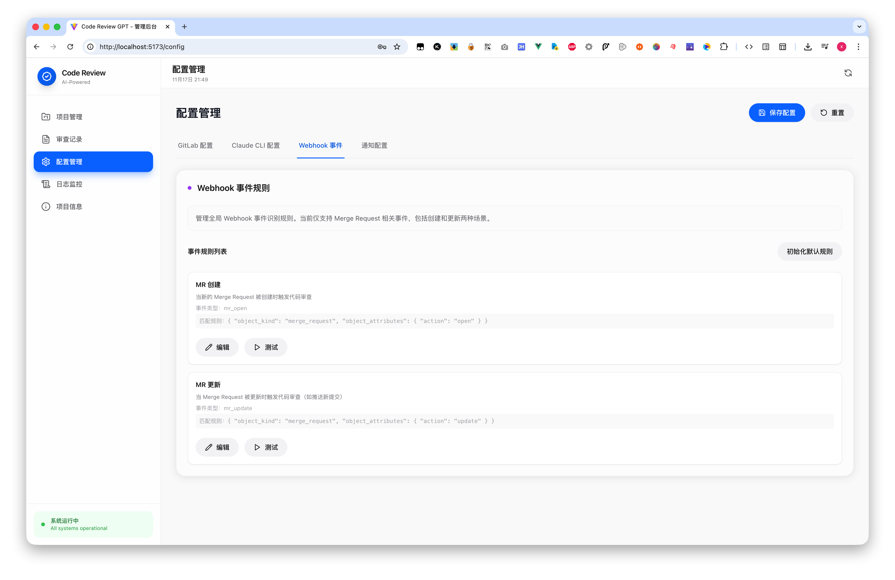
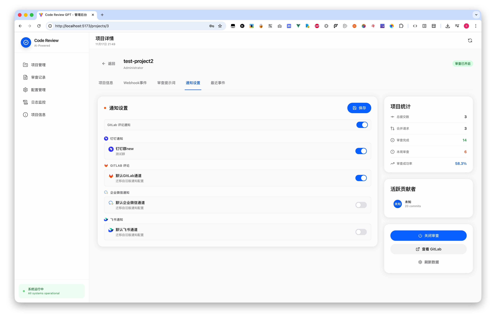

<p align="center">
  
</p>


<h4 align="center">
  <a href="./README_EN.md">English README</a> | <a href="./README.md">中文 README</a>
</h4>

<h4 align="center">
  <a href="https://tqz0rsrhsvf.feishu.cn/docx/FlgzdMrj0oYOg2xXY7EcrsZZnjb?from=from_copylink">📚 官方文档</a>
</h4>
<h4 align="center">
  <a href="#项目描述-">🔍 项目描述</a> •
  <a href="#功能预览-">🍭 功能预览</a> •
  <a href="#部署-">🔧 部署安装</a> •
  <a href="#待办清单-">📌 待办清单</a>
  <a href="#交流-">🚗 联系我们 </a>
</h4>


# 项目描述 📚

> 一个利用大模型帮助我们在 Gitlab 上进行 Code Review 提升研发效能的项目 💪🏻 (( 包括但不限于 GPT 、DeepSeek 等🎁))

**这个项目有什么特点? ✨** 

🐶 针对于 **<span style="background-image: linear-gradient(to right, #ff9900, #ff66cc);-webkit-background-clip: text;color: transparent;font-weight: bold;"> Gitlab </span>** 定制 (计划支持 Github 、Gitlab 、Gitee 、Bitbucket 等)

🤖 我们正在开发 **<span style="background-image: linear-gradient(to right, #ff9900, #ff66cc);-webkit-background-clip: text;color: transparent;font-weight: bold;"> Multi-Agent </span>** 的插件，多个 **<span style="background-image: linear-gradient(to right, #ff9900, #ff66cc);-webkit-background-clip: text;color: transparent;font-weight: bold;"> Agent </span>** 协同工作，共同完成评审

🐱 结合了 **<span style="background-image: linear-gradient(to right, #ff9900, #ff66cc);-webkit-background-clip: text;color: transparent;font-weight: bold;"> 多种大模型对接 </span>** 的能力  🚀

🦊 能够接入私有化 LLM  **<span style="background-image: linear-gradient(to right, #ff9900, #ff66cc);-webkit-background-clip: text;color: transparent;font-weight: bold;"> 代码安全问题 </span>** 

🦁 我们将一直关注效能研发 **<span style="background-image: linear-gradient(to right, #ff9900, #ff66cc);-webkit-background-clip: text;color: transparent;font-weight: bold;"> 最新的Coder Review动态 </span>** 融入这个项目


# 项目架构 🚗
### 前期架构
<p align="center">
  
</p>

### 🚀 **全新架构升级：更强大、更灵活、更高效！** 🌈

<p align="center">
  
</p>

🌟 **丰富的模型接入**　支持轻松接入<span style="background-image: linear-gradient(to right, #ff9900, #ff66cc);-webkit-background-clip: text;color: transparent;font-weight: bold;">更多的模型</span>，无论是经典模型还是最新的 AI 模型，都能轻松集成！  

🔧 **高度定制化**　　　开发者可以<span style="background-image: linear-gradient(to right, #ff9900, #ff66cc);-webkit-background-clip: text;color: transparent;font-weight: bold;">便捷地自定义处理逻辑和回复机制</span>，打造专属于你的解决方案！  

🔗 **扩展性强**　　　　模块化设计使得功能扩展更加方便，未来可以<span style="background-image: linear-gradient(to right, #ff9900, #ff66cc);-webkit-background-clip: text;color: transparent;font-weight: bold;">轻松添加新功能</span>，满足不断变化的需求！  

🛠️ **高可维护性**　　　代码结构清晰，注释详细，便于维护和二次开发，减少开发者的负担！  


**快来体验我们的新架构吧，享受前所未有的强大功能和极致体验！✨**


# 功能预览 🌈

### 主页展示
<p align="center">
  
</p>

### Webhook 配置
<p align="center">
  
</p>

### Prompt 提示词配置
<p align="center">
  
</p>

### 消息通知
<p align="center">
  
</p>

### 详细信息
<p align="center">
  
</p>


# 部署 📖

#### 源代码运行 💻

**后端启动**
```bash
# 克隆仓库
git clone git@github.com:mimo-x/Code-Review-GPT-Gitlab.git
cd Code-Review-GPT-Gitlab/backend

# 安装依赖
pip install -r requirements.txt

# 数据库迁移
python manage.py migrate

# 启动服务
python manage.py runserver 0.0.0.0:8001
# 或使用: ./start.sh
```

**前端启动**
```bash
cd frontend

# 安装依赖
npm install

# 开发模式
npm run dev

# 生产构建
npm run build
```
#### **配置Gitlab webhook**
> 填写```Webhook URL```时，请在域名后添加路径```/api/webhook/gitlab/```，例如：```http://example.com/api/webhook/gitlab/```
<p align="center">
  
</p>

#### **尝试发起一个 Merge Request 吧🎉**


# 交流 👨‍👨‍👦‍👦
👏🏻 很高兴你能向我们提出一些问题和修改建议（Issue，PR）, 欢迎 **star 项目 ⭐️** 

📮 *Email*：**mixuxin@163.com** 

📱 *wx*：**isxuxin**

👨‍👨‍👦‍👦 如果有任何使用问题，欢迎来这里交流（<span style="background-image: linear-gradient(to right, #ff9900, #ff66cc);-webkit-background-clip: text;color: transparent;font-weight: bold;">AI 研发效能领域</span>） 👋 
<p float="left">
   
</p>


# 参考文献 📚
- [(字节)基于大模型 + 知识库的 Code Review 实践](https://mp.weixin.qq.com/s?__biz=Mzg2ODQ1OTExOA==&mid=2247504479&idx=1&sn=1ec09afbb5b5b9b2aaf151994be5fd27&chksm=cea9655ef9deec48b17cbab05ddd1ab04c86736d8b469eaac6f5a707ca110ce4186e8985ff41&mpshare=1&scene=1&srcid=1011C8l5RmCM2EL4Rpl3wdRy&sharer_shareinfo=96d0a83631aaa25db87709baa250085d&sharer_shareinfo_first=96d0a83631aaa25db87709baa250085d#rd)
- [(美团)代码变更风险可视化系统建设与实践](https://tech.meituan.com/2023/09/22/construction-and-practice-of-code-change-risk-visualization-system.html)

## 贡献者 👥

<table>
  <tbody>
    <tr>
      <td align="center" valign="top" width="14.28%">
        <a href="https://github.com/mimo-x">
          <br />
          <sub><b>mimo-x</b></sub>
        </a>
      </td>
      <td align="center" valign="top" width="14.28%">
        <a href="https://github.com/Robbings">
          <br />
          <sub><b>Robbings</b></sub>
        </a>
      </td>
      <td align="center" valign="top" width="14.28%">
        <a href="https://github.com/vstars1">
          <br />
          <sub><b>vstars1</b></sub>
        </a>
      </td>
      <td align="center" valign="top" width="14.28%">
        <a href="https://github.com/kexicui">
          <br />
          <sub><b>kexicui</b></sub>
        </a>
      </td>
      <td align="center" valign="top" width="14.28%">
        <a href="https://github.com/andaoai">
          <br />
          <sub><b>andaoai</b></sub>
        </a>
      </td>
    </tr>
  </tbody>
</table>

## Star History

[](https://star-history.com/#mimo-x/Code-Review-GPT-Gitlab&Date)


# License 📑

**This project is licensed under the [MIT License](https://chat.openai.com/c/9be6b422-f10c-4379-b152-e756230d54f8#:~:text=%E7%9A%84%E5%AE%8C%E6%95%B4%E6%96%87%E6%9C%AC%EF%BC%9A-,MIT%20License,-%E4%BD%A0%E5%8F%AF%E4%BB%A5%E8%AE%BF%E9%97%AE).**
