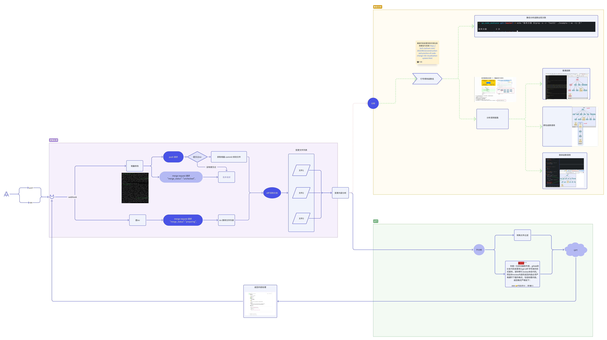
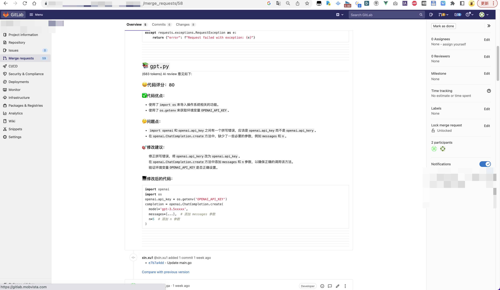
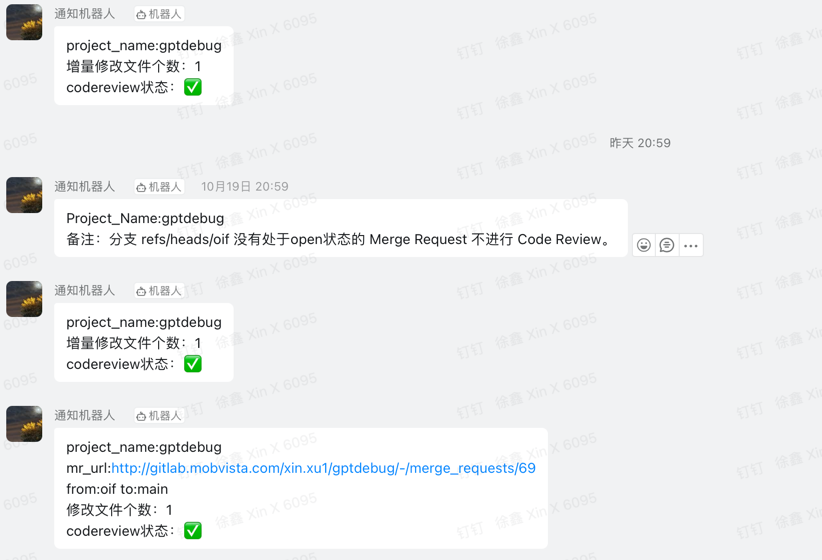

<p align="center">
  
</p>


<p align="center">
  <a href="README.en.md">English README</a> | <a href="README.md">中文 README</a>
</p>


# Description 📚

> A project using LLM to empower Code Review 💪🏻 ((LLM not only includes GPT 🎁))


**What are the characteristics of the project? ✨** 

🐶 We customize it for gitlab

🐱 We combine the powers of <span style="background-image: linear-gradient(to right, #ff9900, #ff66cc);-webkit-background-clip: text;color: transparent;font-weight: bold;">GPT</span> 🚀

🦊 We're going to access <span style="background-image: linear-gradient(to right, #ff9900, #ff66cc);-webkit-background-clip: text;color: transparent;font-weight: bold;">privatization LLM</span> to solve code security issues

🦁 We will always be aware of the <span style="background-image: linear-gradient(to right, #ff9900, #ff66cc);-webkit-background-clip: text;color: transparent;font-weight: bold;">latest developments of code review</span> into the project


# [Project structure 🚗](https://vze9i86ezn.feishu.cn/docx/BuFidAogAoH1ecxQstscBUdhnfb?openbrd=1&doc_app_id=501&blockId=YneudO6sRoXPFIxkohtcgbwenye&blockType=whiteboard&blockToken=Yd3CwIPdphgGmFbWcRfcx9aNnrf#YneudO6sRoXPFIxkohtcgbwenye)

<p align="center">
  
</p>


# Results preview 🌈

### 1. Gitlab Code Review for Merge Request
<p align="center">
  
</p>

### 2. Dingding-code-review message 
<p align="center">
  
</p>

### 3. Integration of More Large Models

1. Custom models can be quickly integrated by implementing the project interface. 
For specific configuration methods, refer to [config.md](doc/config.md).
2. The project supports multiple models through [UnionLLM](https://github.com/EvalsOne/UnionLLM/), 
which is compatible with [LiteLLM](https://docs.litellm.ai/docs). 
The default supported models are listed in the table below.

<table style="width:100%; text-align:center; border-collapse:collapse;">
  <tr>
    <td>OpenAI</td>
    <td>Azure</td>
    <td>AWS - SageMaker</td>
    <td>AWS - Bedrock</td>
  </tr>
  <tr>
    <td>Google - Vertex_AI</td>
    <td>Google - Palm</td>
    <td>Google AI Studio - Gemini</td>
    <td>Mistral AI API</td>
  </tr>
  <tr>
    <td>Cloudflare AI Workers</td>
    <td>Cohere</td>
    <td>Anthropic</td>
    <td>Empower</td>
  </tr>
  <tr>
    <td>Huggingface</td>
    <td>Replicate</td>
    <td>Together_AI</td>
    <td>OpenRouter</td>
  </tr>
  <tr>
    <td>AI21</td>
    <td>Baseten</td>
    <td>Vllm</td>
    <td>NLP_Cloud</td>
  </tr>
  <tr>
    <td>Aleph Alpha</td>
    <td>Petals</td>
    <td>Ollama</td>
    <td>Deepinfra</td>
  </tr>
  <tr>
    <td>Perplexity-AI</td>
    <td>Groq AI</td>
    <td>DeepSeek</td>
    <td>Anyscale</td>
  </tr>
  <tr>
    <td>IBM - Watsonx.ai</td>
    <td>Voyage AI</td>
    <td>Xinference [Xorbits Inference]</td>
    <td>FriendliAI</td>
  </tr>
  <tr>
    <td>Galadriel</td>
    <td>智谱AI</td>
    <td>月之暗面 Moonshot</td>
    <td>百度文心一言</td>
  </tr>
  <tr>
    <td>阿里巴巴通义千问</td>
    <td>MiniMax</td>
    <td>讯飞星火</td>
    <td>百川智能</td>
  </tr>
  <tr>
    <td>昆仑天工</td>
    <td>零一万物</td>
    <td>阶跃星辰</td>
    <td>字节豆包</td>
  </tr>
  <tr>
    <td>DeepSeek</td>
    <td>More</td>
    <td></td>
    <td></td>
  </tr>
</table>
# Usage 📖

### install
#### Run by Source code
1.**clone repo**
```bash
git clone git@github.com:mimo-x/Code-Review-GPT-Gitlab.git
```
2.**install requirements**
```bash
pip install -r requirements.txt
```
3.**modify config file**
```bash
vim config/config.py
```
4.**run**
```bash
python3 app.py
```
5.**config gitlab webhook**
> When filling in the ```Webhook URL```, please add ```/git/webhook``` after the domain name. For example: ```http://example.com/git/webhook```
<p align="center">
  
</p>
6.**make a mr 🎉**


   
#### Docker

```bash
todo dockerfile
```


# Todo List 📌

- ✅ Use GPT to Code Review
- [ ] Try to access the privatization LLM to Address code security issues
- [ ] Enable more trigger methods
  - ✅ Merge Request
  - [ ] for every commit
  - [ ] for tag
- [ ] FeiShu(飞书) Code Review message notification
- [ ] Static code analysis to Analyze the risk level of modifying code

# Communication 👨‍👨‍👦‍👦
👏🏻You're welcome to ask us questions（issue，pr）, Thank you for your star ⭐️ 

📮 Email：mixuxin@163.com 

👨‍👨‍👦‍👦 This is our WeChat group


# reference 📚
- [(字节)基于大模型 + 知识库的 Code Review 实践](https://mp.weixin.qq.com/s?__biz=Mzg2ODQ1OTExOA==&mid=2247504479&idx=1&sn=1ec09afbb5b5b9b2aaf151994be5fd27&chksm=cea9655ef9deec48b17cbab05ddd1ab04c86736d8b469eaac6f5a707ca110ce4186e8985ff41&mpshare=1&scene=1&srcid=1011C8l5RmCM2EL4Rpl3wdRy&sharer_shareinfo=96d0a83631aaa25db87709baa250085d&sharer_shareinfo_first=96d0a83631aaa25db87709baa250085d#rd)
- [(美团)代码变更风险可视化系统建设与实践](https://tech.meituan.com/2023/09/22/construction-and-practice-of-code-change-risk-visualization-system.html)


# License 📑

**This project is licensed under the [MIT License](https://chat.openai.com/c/9be6b422-f10c-4379-b152-e756230d54f8#:~:text=%E7%9A%84%E5%AE%8C%E6%95%B4%E6%96%87%E6%9C%AC%EF%BC%9A-,MIT%20License,-%E4%BD%A0%E5%8F%AF%E4%BB%A5%E8%AE%BF%E9%97%AE).**


